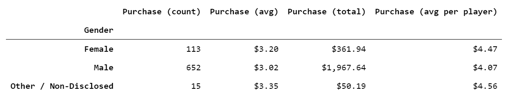

# Pandas

**Background**

Project story.

**Project Scope**

Project plan and tasks.

- Using Jupyter Notebooks, import dependencies:
   ```
   import pandas as pd
   file_to_load = "Resources/purchase_data.csv"
   purchase_data = pd.read_csv(file_to_load)
   ```

- Player Count
   ```
   player_count = purchase_data["SN"].value_counts()
   player_count = player_count.count()
   players_df = pd.DataFrame({"Total Players": [player_count]})
   ```
   

- Purchasing Analysis
   ```
   item_count = purchase_data["Item ID"].value_counts()
   item_count = item_count.count()
   avg_price = purchase_data["Price"].mean()
   total_revenue = purchase_data["Price"].sum()
   summary_df = pd.DataFrame({
      "Number of Unique Items":[item_count],
      "Purchase (avg)":[avg_price],
      "Purchase (count)":[purchase_count],
      "Total Revenue":[total_revenue]
   })
   summary_df.style.format({
      "Purchase (avg)":"${:.2f}",
      "Total Revenue":"${:.2f}"
   })
   ```
   


<!-- **Analysis**

Project statistics.

|Table|Col1|Col2|
|----|----|----|
|1|2|3|4|

**Findings**

Project insights from data and process.

**Conclusion**

Futher action, data exploration and limitations.

### [Online Purchases Analysis](https://github.com/dianewitt/pandas) *from .csv data using Python and Pandas*
   * Sample Pandas code
      ```purchase_count = gender_group["Purchase ID"].count()
      purchase_count
      
      avg_price = gender_group["Price"].mean()
      avg_price

      total_revenue = gender_group["Price"].sum()
      total_revenue

      avg_player_purchase = total_revenue/gender_count
      avg_player_purchase
      ```
       -->