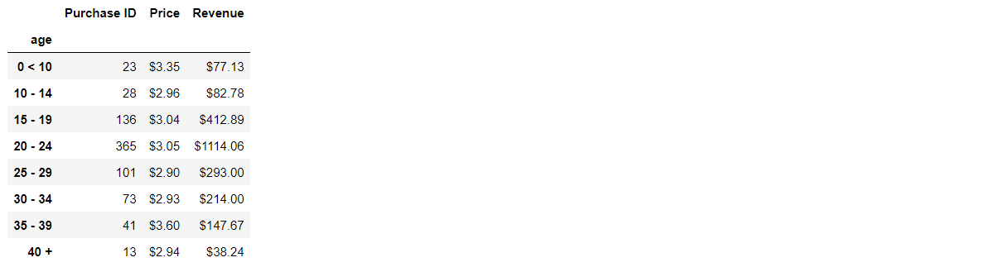

# Pandas

**Background**

Analyzing (fictional) online game purchase data.

**Project Scope**
- In a new Jupyter notebook, loading data into pandas from a .csv file.
   ```
   import pandas as pd
   file_to_load = "Resources/purchase_data.csv"
   purchase_data = pd.read_csv(file_to_load)
   ```
- Creating pandas dataframes to clean, filter and summarize the data.
- Analyzing purchase data using player metadata to identify trends.

**Analysis**
- Purchase count, average price and total revenue. 

   
- Purchase count, average price and total revenue by Gender. 
   
   
- Purchase count, average price and total revenue by age group. 
   
   
- Total purchase count by player.
   
   
- Total revenue by player.

   

**Summary and Insights**
- *780 total purchases, with 570 players, across 179 games, with $2,380 total revenue and an average purchase of $3.05.*
 
- *Males have the most purchases and total sales amount, but the lowest average purchase at $3.02.*

- *Age group 20-24 has the most purchases by both purchase count and revenue while age group 35-39 has highest average purchase of $3.60.*

- The player with the most purchases, and the most purchase revenue is Lisosia93 with 5.

   
   

- *The most purchased game is Final Critic:*

   

<!-- **Conclusion**

Futher action, data exploration and limitations. -->