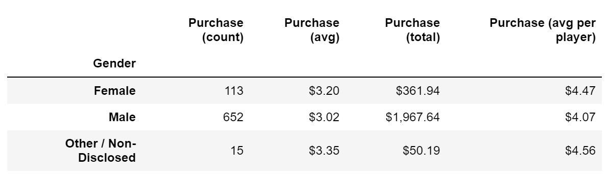
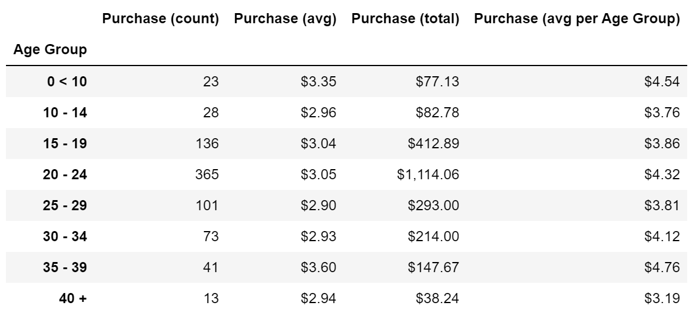
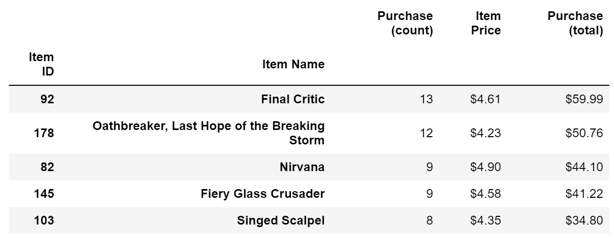

### Pandas Library and Jupyter Notebook

### Three Observable Trends from the above Analysis

1. Male players made 652 purchases, the most of any gender
2. 

2. Players between the ages of 20 and 24 made 365 purchases, the most of any other age group in the dataset
3. 

3. The "Final Critic" had 13 purchases, the most among all games, and also has the highest total purchase value of $59.99
4. 

