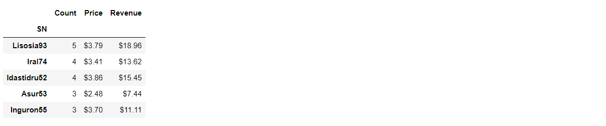
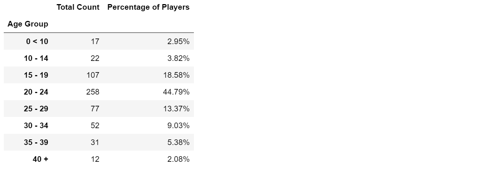

# Pandas

**Background**

Project story.

**Project Scope**

Project plan and tasks.

- Using Jupyter Notebooks, import dependencies and read data file into pandas:

   ```
   import pandas as pd
   file_to_load = "Resources/purchase_data.csv"
   purchase_data = pd.read_csv(file_to_load)
   ```
**Analysis**

<!-- Project statistics.

|Table|Col1|Col2|
|----|----|----|
|1|2|3|4|

**Findings** -->

Project insights from data and process.
- Player Count
   ```
   player_count = purchase_data["SN"].value_counts()
   player_count = player_count.count()
   ```
   

- Purchasing Analysis
   ```
   item_count = purchase_data["Item ID"].value_counts()
   item_count = item_count.count()
   avg_price = purchase_data["Price"].mean()
   total_revenue = purchase_data["Price"].sum()
   ```
   

- Age Analysis
   

- Demographics

   

- Gender Analysis
   

- Most Popular
   

- Most Profitable
   

**Conclusion**

Futher action, data exploration and limitations.